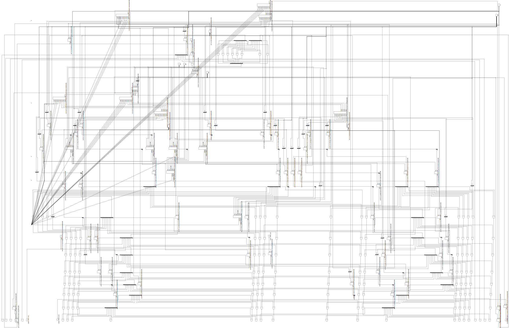

# TAADDA CPU 

Totally  
Awesome  
Architecture  
Dude!  
Dude,  
Architecture!  

TAADDA is a CPU architecture that I made for learning purpuoses using the sandbox of [Turing Complete](https://turingcomplete.game), a circuit simulator.

Turing Complete is able to export to Verilog, it is very unoptimized, but still pretty cool.

Schematic rendered from the Verilog


Simple Diagram


## Notes

The architecture is 32-bit. The assembly is pretty straight-forward, it's fixed-size with four bytes of instruction. The CPU is loosely ARM based, and is classified as Harvard architecture. The CPU contains an ALU, conditional unit, program memory, RAM, stack, program counter, input, output, and registers.

The RAM, program memory, and stack are all 256 bytes.

Byte0, OPCO is the opcode byte  
Byte1, ARG1 is the first argument address byte  
Byte2, ARG2 is the second argument address byte  
Byte3, DEST is the destination address byte

### Addresses

0-3: General purpose registers.  
  4: Stack
  5: RAM Register  
  6: Program Counter  
  7: System Input and Output  
  8: RAM
  
### Addressing Modes

The CPU uses two methods modes to access data.
Register Direct: Default mode. ARG1, ARG2, and DEST directly specify the address of a register within the CPU. This is how to access data stored in the registers.
Immediate: When in immediate mode ARG1 or ARG2 contain a value, rather than an address.

### Components

#### RAM

The RAM stores runtime data of the program. The address of the RAM that is being accessed/written to is held in Register 5. Data is saved to RAM when the DEST byte is 8. Data is loaded from RAM to ARG1 or ARG2 when ARG1 or ARG2 respectively is 8.

#### Stack

The stack can be used to store temporary values and function return addresses.

To pop a value from the stack, ARG1 or ARG2 must be 4 and OPCO bit 3 must be 0. The value is then sent to the ARG1 or ARG2 data bus.

To push a value to the stack, DEST must be 4 and OPCO bit 3 must be 1, then the output of the ALU is pushed to the stack.  

These criteria are overridden when dealing with functions.

## Opcodes for Instruction:

ALU:  
The ALU takes ARG1 and ARG2, then saves the value to the DEST address.  
| Opcode | Instruction | Details |
| ------ | ----------- | ------- |
| 0 | ADD | - |
| 1 | SUB | ARG1 - ARG2 |
| 2 | AND | Bitwise AND |
| 3 | OR  | Bitwise OR |
| 4 | NOT | Bitwise NOT, only takes ARG1 |
| 5 | XOR | Bitwise XOR |

Conditional Unit:  
The conditional unit is used when OPCO bit 5 is set to 1. To write binary for the cond unit, refer to the chart below and add 32 to each opcode.
When a condition is true, than the value of the PC is set to the immediate value of DEST.
| Opcode | Instruction | Details |
| ------ | ----------- | ------- |
| 0 | EQUALS | - |
| 1 | NOT EQUALS | - |
| 2 | LESS THAN | ARG1 < ARG2 |
| 3 | LESS THAN EQUALS | ARG1 <= ARG2 |
| 4 | GREATER THAN | ARG1 > ARG2 |
| 5 | GREATER THAN OR EQUALS | ARG1 >= ARG2 | 

Immediate Values:  
Bit 6 makes ARG1 immediate.  
Bit 7 makes ARG2 immediate.  
In other words, add 64 and/or 128 to the instruction for an immediate value.  

Functions:  
When bits 3, 5, 6, and 7 are 1, the CPU ignores ARG1 and ARG2, and performs function calls and returns.  
If bit 4 is 0: PC is set to the immediate value of DEST and the current value of the PC is pushed to stack  
If bit 4 is 1: The top value on the stack is popped, and PC is set to popped value + 4.  

Effectively:
| Opcode | Instruction | Details |
| ------ | ----------- | ------- |
| 232 | CALL | Jumps to program memory address of DEST value |
| 248 | RETURN | Returns to instruction after address where function is called |

## Example Programs

Each line is a byte in the program memory

Basic example:  
An infinitely looping program

```asm
192 ; add (0) + immediate 1 (64) + immediate 2 (128)
10  ; ARG1 immediate value
2   ; ARG2 immediate value
0   ; save to register 0
129 ; subtract (1) + immediate 2 (128)
0   ; register 0 value, currently 12 
6   ; ARG2 immediate value
1   ; save 12-6 to register 1
160 ; cond (32) + if equals (0) + immediate 2 (128) 
1   ; register 1 value, currently 6
6   ; ARG2 immediate value
0   ; jump address if conditional is true, will restart the program
```

RAM example:  
This program takes in 32 values from input then stores the values in RAM. Values are then outputted from RAM.

```asm
; takes input and stores in ram
64 ; add (0) + immediate 1 (64)
0  ; ARG1 imm val
7  ; input value
8  ; save to ram
; increases RAM reg by 1
64 ; add (0) + imm1 (64)
1  ; arg1 imm val
5  ; val in reg5
5  ; save to reg5
; if 32 inputs haven't been stored yet, jump to beginning
162 ; cond (32) + if less (2) + imm2 (128)
5   ; val in reg5
32  ; arg2 imm val
0   ; jump to byte0
; set RAM reg to 0
192 ; add (0) + imm1 (64) + imm2 (128)
0   ; imm1
0   ; imm2
5   ; save to reg5
; move RAM value to output
64 ; add (0) + imm1 (64)
0  ; imm1
8  ; ram val at address of reg5
7  ; save to output
; increase RAM reg by 1
64 ; add (0) + imm1 (64)
1  ; imm1
5  ; val in reg5
5  ; save to reg5
; if all 32 values haven't been outputted yet, jump to start of output
162 ; cond (32) + if less (2) + imm2 (128)
5   ; val in reg5
32  ; imm2
16  ; jump to start of output process, byte 16, if condition true
```

Function example:  
Computes to the 12th Fibonacci number.

```asm
; default value in registers is 0, so no need to set reg0 to 0
; sets reg1 to 1
192 ; add (0) + imm1 (64) + imm2 (128)
0
1
1
; takes input, will compute to input number of sequence, saves to reg3
; subtracting 1 because starting with 0 and 1
129 ; sub (1) + imm2 (128)
7
2
3
; initial function call
232 ; function call (232)
0   ; ignored val
0   ; ignored val
20  ; address of function called
; moves result of function to output
128 ; add (0) + imm2 (128)
1
0
7   ; output
; jumps to the end of the program
224 ; cond (32) + if equal (0) + imm1 (64) + imm2 (128), this is always true
0
0
255 ; end of program memory
; start of the function, adds reg0 and reg1 saves to reg2
0 ; add (0)
0
1
2
; moves reg1 to reg0
128 ; add (0) + imm2 (128)
1
0
0
; moves reg2 to reg1
128 ; add (0) + imm2 (128)
2
0
1
; decreases the counter, stored in reg3, by one
129 ; sub (1) + imm2 (128)
3
1
3
; if counter is one, jump to base condition
160 ; cond (32) + if equal (0) + imm2 (128)
3
1
44  ; address of base case (conditional jump over function call)
; if counter isn't zero, recure further
232 ; function call (232)
0
0
20  ; address of function
; base case
252 ; return from function (252)
0   ; ignore val
0   ; ignore val
0   ; ignore val
```


## Creating the schematic

I first exported the CPU from the Turing Complete simulation to Verilog, and fixed some of the auto generated Verilog. Then I used `yosys` with `yosys generate_json.v` to create a JSON of the CPU. I used `netlistsvg` to create an SVG of the JSON. 
